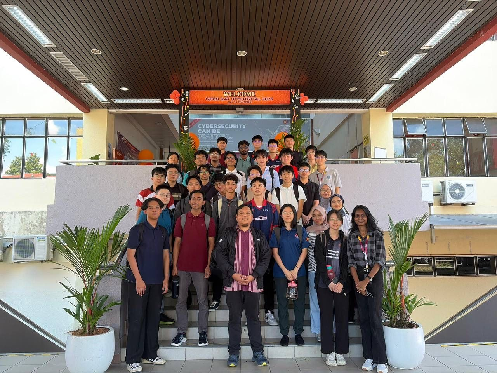
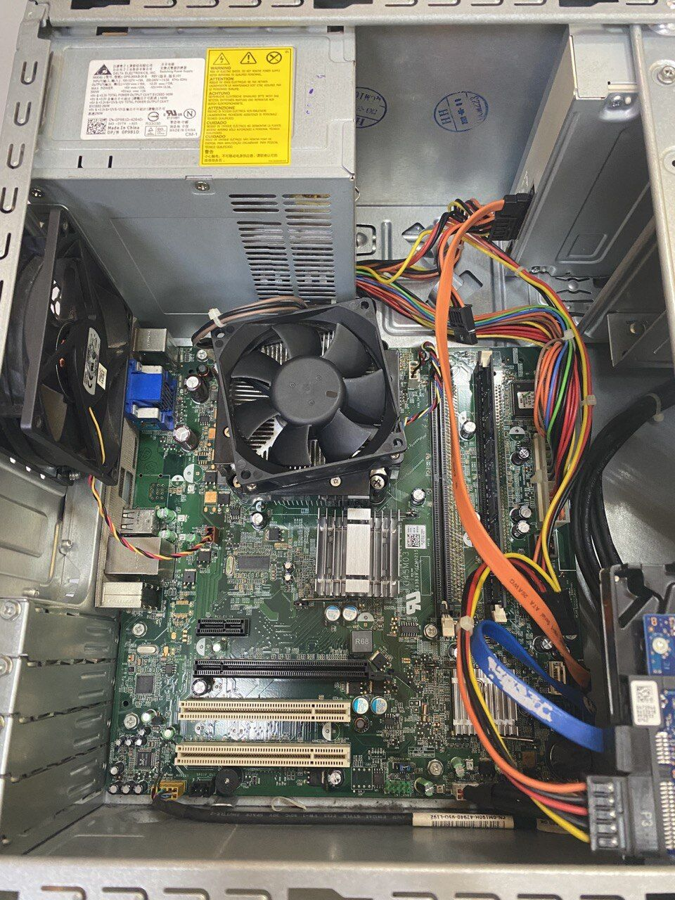
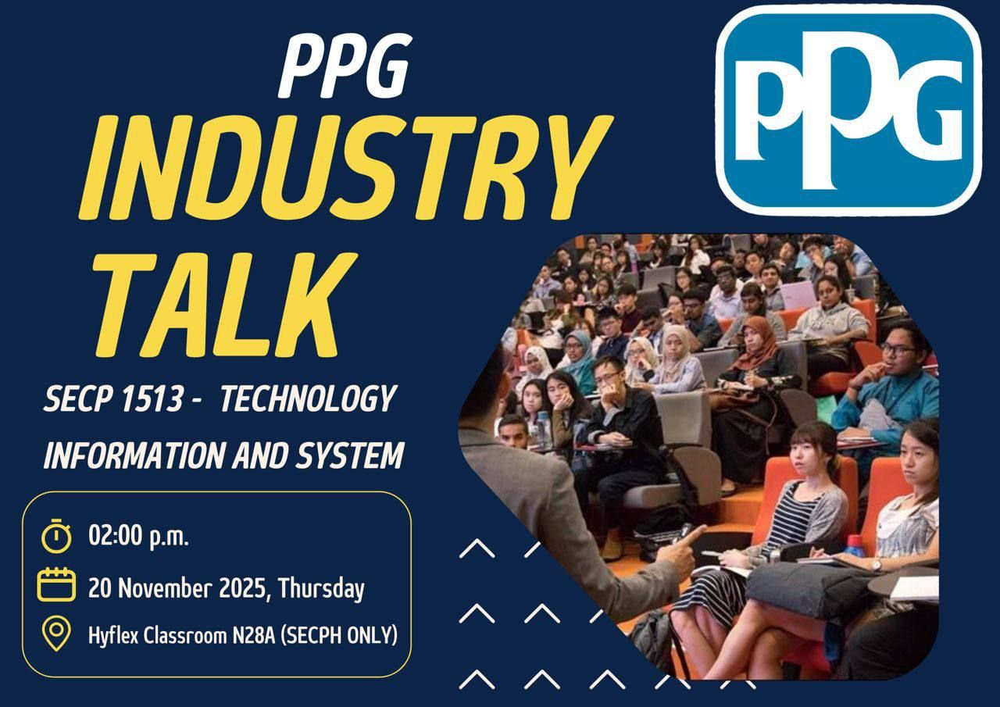
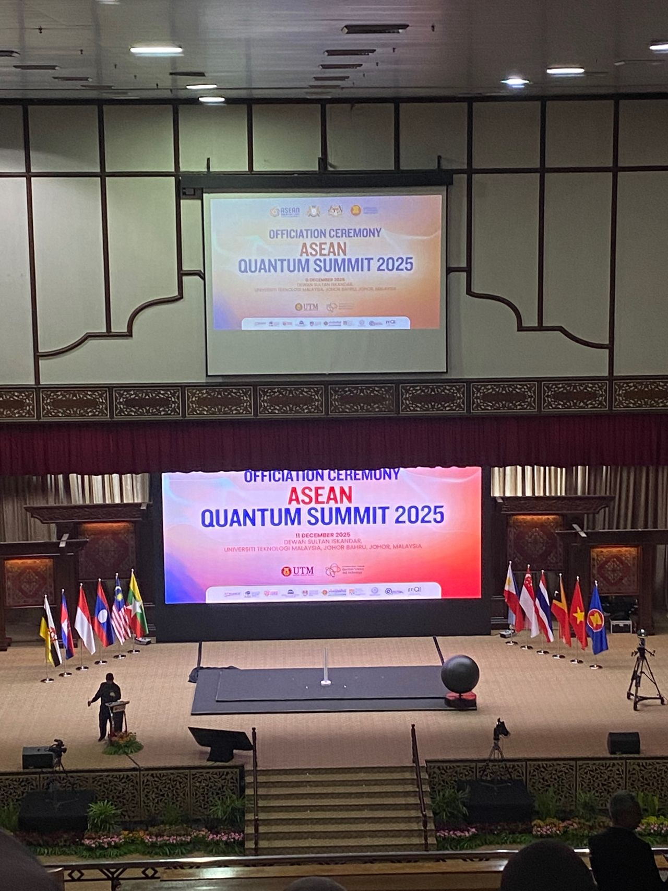
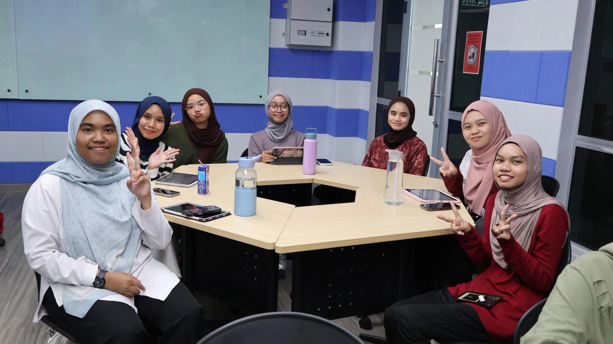

|  No  |    Assignments      |                Reflection              |      Evidence          |
|------|---------------------|----------------------------------------|------------------------|
|1|Industry Visit 1 - UTM Digital    |I gained useful exposure to various digital technologies and solutions through the different booths, which showed how technology supports digital transformation. The talk by Mr. Ronald Chong from Canon helped me understand how data and imaging technologies can be turned into meaningful insights for real-world applications. Overall, this experience improved my understanding of how digital information is used in practice and increased my interest in digital technology.           ||
|2|Lab - PC Assemble   |We did a hands-on activity about how to assemble and disassemble a PC. I learned about all the important components that make a PC work properly such                         as PC casing, cables, power supply, RAM, hard disk, and CPU fan.We also learned how to assemble each part in the correct position so the PC can function well. This activity gave me a lot of new knowledge and practical experience, especially in understanding PC hardware components and their functions.||
|3|Industry Talk 1 - PPG|I gained a better understanding of how ICT roles support real business operations and digital transformation in a global organization. I learned how data analytics turns raw data into meaningful insights and why skills such as SQL, Python, and data visualization are important in the industry. The talk also helped me understand cloud infrastructure management using the Plan–Build–Run model and the use of multi-cloud platforms such as AWS. In addition, I learned how SAP supports core business processes as a single source of truth. Overall, this industry talk motivated me to improve my technical skills and better prepare myself for future challenges in the ICT industry.| |
|4|Online Global Classroom |I learned that trust is very important in intelligent systems.The speakers explained how AI is used in cybersecurity to protect data and systems. I also learned how blockchain and AI can work together to strengthen digital trust. The session helped me understand the importance of ethics and responsibility in development. This session increased my awareness of security and trust in intelligent systems. It motivated me to learn more about ethical AI and cybersecurity. Overall, the session helped me see how intelligent systems should be designed responsibly and securely. ||
|5|ASEAN Quantum Summit 2025            |From attending the ASEAN Quantum Summit 2025, I gained a better understanding of how quantum technology and advanced computing can shape the future of technology in the ASEAN region. I learned that strong collaboration between the government is very important to turn research into real-world applications. The summit also make me realised why long-term planning and talent development are needed. Overall, this experience motivated me to keep learning and preparing myself so that my current knowledge can contribute to future technological innovation.            ||
|6|Industry Talk 2|The talk from Ts. Hj. Abdul Alim bin Abdul Muttalib, I learned the importance of system development and project management. I understood that the Software Development Life Cycle (SDLC) helps in developing a complete and reliable system in an organized way. The talk also made me realize that good project management is necessary to avoid project failure. In addition, the speaker encouraged students to focus on understanding, start learning seriously from the first year, and keep exploring new technologies. Overall, this talk motivated me to be more serious in my studies and better prepared for future industry challenges.|  | |7|Industry Visit 2 - ETIQA   |I gained valuable exposure to the real working environment in industry. I also learned the importance of mastering technical skills such as SQL, communication skills, and building professional networks. The sharing session and office tour helped me understand how a company operates and how employees manage work-life balance. Overall, this industrial visit motivated me to work harder, manage my time better, and continuously improve my skills to prepare myself for future career challenges in a highly competitive industry. |                                                                                                         [Open Day(https://github.com/miqbaltariq/SECP1513202520261/blob/42c84c539827092e4b2a2c155c1ea4346da1caf9/Fatihah0thman/assignment/industryvisit2.pdf)||8|Design Thinking Project|Through this project, I learned how to understand problems clearly before proposing a solution by using the design thinking approach. I also learned that following the SDLC helps me plan, design, test, and improve a system in a structured way. This project showed me the importance of user feedback in every phase of development. I improved my teamwork and communication skills by working with my group members. Overall, this project helped me think more systematically and confidently when developing a system.| |

