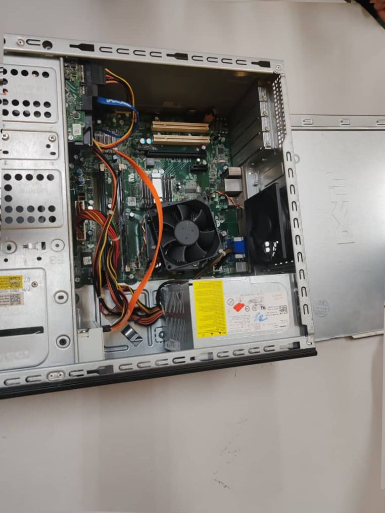
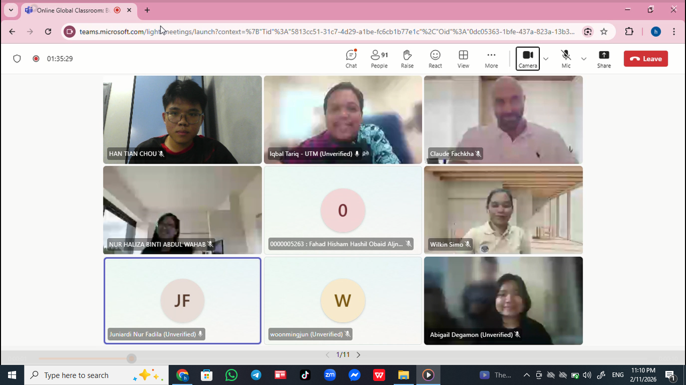
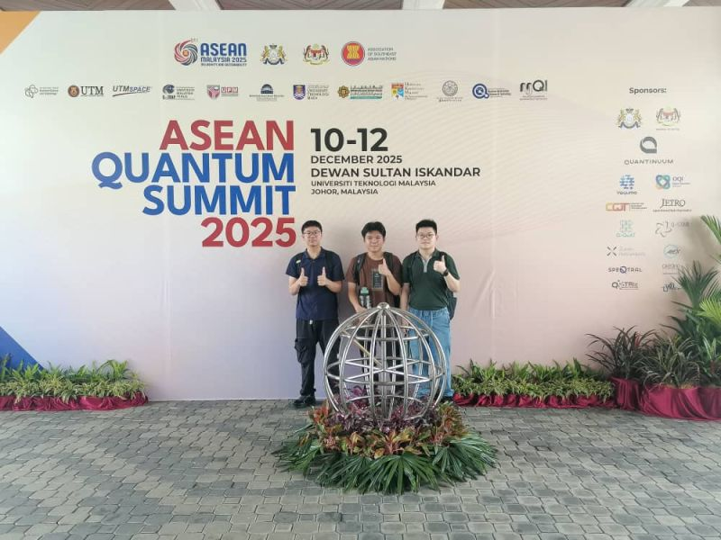

## Technology and Information System - Assignment Reflection
| No |Assignment|Reflection|Evidence|
|----|---------|-----------|------- |
| 1  |Industry Talk: PPG|Through the talk, i understand how importance a programmer since even a painting company require programmer to handle clients data and a series of work. The talk also helping me to get deep into what a cloud computing is and how a big organisation utilizing it .Overall, this talk motivated me to further equip myself with both technical and analytical skills. Moving forward, I aim to strengthen my knowledge in data analytics tools, cloud technologies, and AI-related concepts to better prepare myself for real-world industry environments. |[View poster](ASSIGNMENT%20INDUSTRIAL%20TALK%201.pdf)|
| 2  |Industry Visit: UTM Digital |Thorugh the visit, i had gained valueble insight from each seesion.From the talk given i get to know the trend of the world which is AI.Not only that,from the interview, we get to know that being prepare as a programmmer need to equipped ourselves with different programming language and constantly improve ourself even after getting employee is important as well.|[View video](Assignment2video.mp4)|                     
| 3  |PC Assemble |Through this activity, i gain some basic knowledge of assembling and disassemblingpc.Not only that, some common sense was told too such as unplugging the power cable before doing anything.ALthough it is seems basic, these knowledges are vital to avoid damaging pc.After that, a quiz test was given to strengthen our memory.Overall, it is a fun and meaningful experience for me.||                  
| 4  |Industry Talk: Online Global Classroom|Through the talk , i had gained valueble perspective of AI from diffrent speakers.As a conclusion, the trend of AI is inevitable but how should we utilize it sparks a great controversy.Therefore, as an ethical utm students, we should use AI as a tool that give suggestion instead of getting the answer directly, orelse it is meaningless for our study journey.Other than that, through the talk i also learned that cybersecure issue cannot be neglected expecially in this AI era where hacker attacks become more easy to be achieve ||
| 5  |ASEAN Quantum Summit 2025 |Through this activity, i gained valueble insights into Johor’s development blueprint, highlighting how infrastructure, policy, and people work together to foster deep-tech growth and position the region as a technology-driven hub.I also had the opportunity to learn from global experts about the applications of quantum technologies, including quantum computing, quantum biology, and modeling natural systems such as the nitrogen cycle. This experience broadened my perspective on how emerging technologies intersect with computer science, data engineering, and smart city initiatives.Overall, attending the summit strengthened my understanding of the future opportunities in technology and deepened my motivation to develop skills in data-driven solutions and innovative computing approaches. It was inspiring to witness how quantum technologies are shaping the next wave of scientific and industrial progress. |     |
| 6  |Industry Talk: Serunai Commerce |Through the talk, i had learned an extremely vital item for programmers, Software Development Life Cycle(SDLC).From the speakers, i get to know how important for us to enhance our programming language especially SQL. I also get to know developinng a program is not just simplily develop it.It need to be plan,analysis,design then it can be implement.After that, it even need to be test and maintenace work should not be neglect as well.Overall, from the talk , i get to know what a programmer challenge or it could be say whaat is my future task.|[View report](ASSIGNMENT3REPORT.pdf)|     
| 7  |Industry Visit: Etiqa|By and large,the visit gave me insight into the different teams within a programming environment, including AI, data engineering, data analysis, and business analysis teams. Team leaders explained their roles, demonstrated how they approach problem-solving, and shared examples of tasks they handle on a daily basis. They also recommended essential tools and programming knowledge, such as Python, and highlighted the importance of AI tools in modern workflows for AI-powered transformation. Overall, the experience was insightful, as it allowed me to see firsthand how programmers operate in a real-world company and understand the skills and mindset required to be a qualified professional in the field. |[View newsletter]()|
| 8  |Design Thinking Project|
